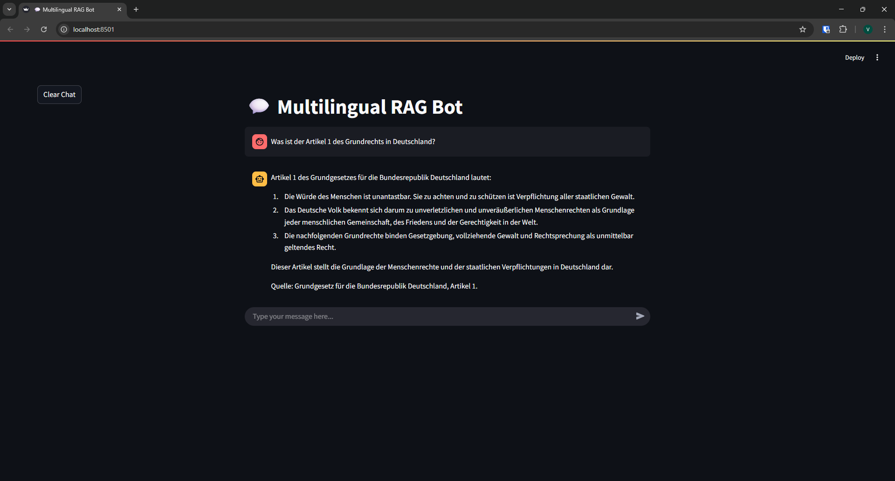
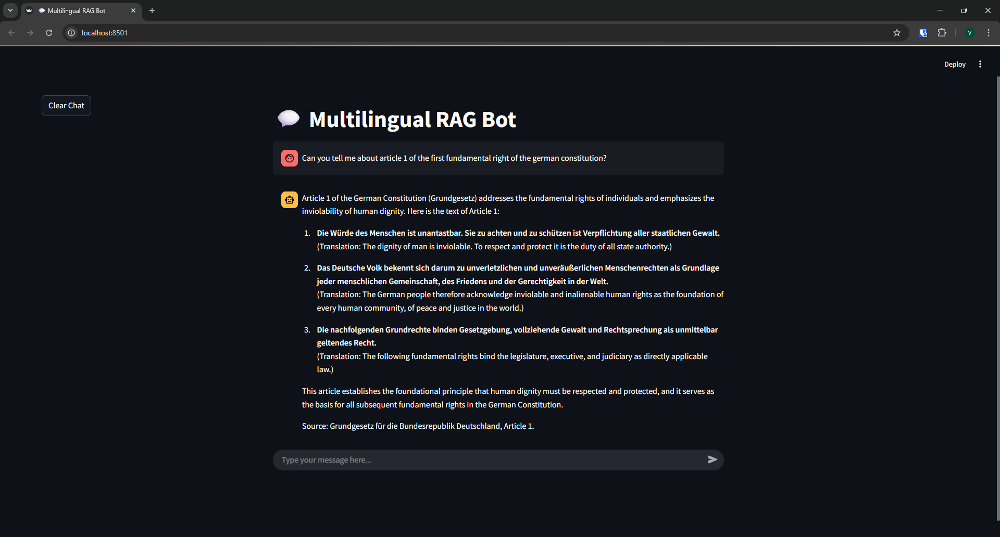

# Multilingual RAG Agent 🌐

A sophisticated ReAct type agent application that leverages Corrective Retrieval-Augmented Generation (CRAG) to provide accurate, context-aware responses across multiple languages. The system is particularly designed to work with legal documents and can seamlessly handle queries and documents in different languages.

## Example Interactions

### German Query

*Example of a query in German about Article 1 of the German Constitution*

### English Query

*Example of the same query in English, demonstrating multilingual capabilities*

## Overview 🔍

This project implements a multilingual agent using:
- LangGraph for Agentic Workflow
- LangChain for RAG implementation
- ChromaDB for vector storage
- Streamlit for the user interface
- OpenAI's language models for natural language processing
- Custom tools for language detection and query reformation

### Key Features ✨

- **Multilingual Support**: Automatically detects and handles queries in different languages
- **Intelligent Query Reformulation**: Reformats queries to match document language when needed
- **Document Retrieval**: Efficiently retrieves relevant information from stored documents
- **Clean User Interface**: Three-column layout with intuitive chat interface
- **Conversation Memory**: Maintains context throughout the conversation

## Installation and Setup 🛠️

### Prerequisites

- Python 3.12 or higher
- An OpenAI API key

### Installation Steps

1. Clone the repository:
   ```bash
   git clone https://github.com/vishalsukumar/multilingual-rag.git
   cd multilingual-rag
   ```

2. Set up a virtual environment:
   ```bash
   python -m venv .venv
   # On Windows
   .venv\Scripts\activate
   # On Unix or MacOS
   source .venv/bin/activate
   ```

3. Install dependencies:
   ```bash
   pip install -e .
   ```

4. Configure environment variables:
   ```bash
   cp config/sample_dotenv .env
   ```
   Then edit `.env` and add your OpenAI API key:
   ```
   OPENAI_API_KEY="your-api-key-here"
   ```

5. Add your personal PDF files on which you want to Retrieve in the data folder:
   ```bash
   cp sample.pdf data/
   ```

## Usage 💡

1. Start the Streamlit application:
   ```bash
   streamlit run streamlit_app.py
   ```

2. To Add files to your knowledge base:
   - Kill the running application
   - Add the pdf files to the data folder
   - Delete the vector_store dir where the embeddings are saved
   ```bash
   rm -r vector_store
   ```
   - Restart the Streamlit application

## Project Structure 📁

```
Multilingual-RAG/
├── config/
│   └── sample_dotenv       # Template for environment variables
├── data/
│   └── Duetsche_Grundgesetz.pdf    # Sample legal document
├── src/
│   ├── agent.py           # RAG agent implementation
│   ├── constants.py       # Constants used
│   ├── prompts.py         # System prompts
│   ├── tools.py           # Custom tools implementation
│   ├── utils.py           # Helper functions
│   └── vector_store.py    # Vector store setup
├── streamlit_app.py       # Streamlit UI implementation
├── pyproject.toml         # Project dependencies
└── README.md             # Project documentation
```

## How It Works 🔄

1. **Document Processing**:
   - Documents are processed and stored in a ChromaDB vector store
   - Text is embedded for efficient semantic search

2. **Query Processing**:
   - User input is analyzed for language
   - If needed, queries are reformulated to match document language
   - Relevant documents are retrieved using semantic search

3. **Response Generation**:
   - Retrieved documents are used as context
   - LLM generates accurate, context-aware responses
   - Responses are streamed in real-time to the UI

## Contributing 🤝

Contributions are welcome! Please feel free to submit pull requests.

1. Fork the repository
2. Create your feature branch 
3. Commit your changes 
4. Push to the branch 
5. Open a Pull Request

## License 📄

This project is licensed under the MIT License.

## Acknowledgments 🙏

- Built with LangChain and LangGraph
- Powered by OpenAI's language models
- UI implemented with Streamlit